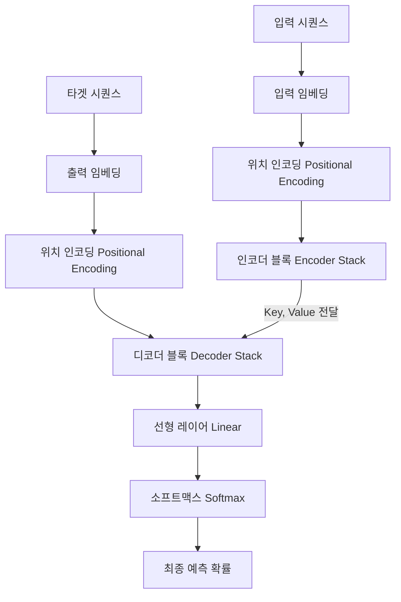

# Day 1: PyTorch로 바닥부터 구현하는 트랜스포머 (Transformer from Scratch)

트랜스포머(Transformer)는 2017년 Google의 "Attention is All You Need" 논문에서 제안된 이후, 현대 자연어 처리(NLP)와 LLM(Large Language Model)의 근간이 되는 아키텍처입니다. 

이 문서에서는 트랜스포머의 핵심 구성 요소를 PyTorch를 사용하여 바닥부터 직접 구현하고, 더미 데이터를 통해 모델이 어떻게 작동하는지 단계별로 명확하게 설명합니다.

---

## 1. 트랜스포머 전체 아키텍처 개요

트랜스포머는 **인코더(Encoder)**와 **디코더(Decoder)**로 구성된 시퀀스-투-시퀀스(Seq2Seq) 구조입니다.



---

## 2. 핵심 컴포넌트 구현

### ① 위치 인코딩 (Positional Encoding)
트랜스포머는 순환 신경망(RNN)과 달리 데이터를 순차적으로 입력받지 않고 한 번에 입력받기 때문에, 단어의 **위치 정보(Order/Position)**를 모델에 명시적으로 제공해야 합니다. 이를 위해 사인(Sine)과 코사인(Cosine) 함수를 이용한 고정된 위치 벡터를 생성하여 임베딩 벡터에 더해줍니다.

$$\text{PE}_{(pos, 2i)} = \sin\left(\frac{pos}{10000^{2i/d_{model}}}\right)$$
$$\text{PE}_{(pos, 2i+1)} = \cos\left(\frac{pos}{10000^{2i/d_{model}}}\right)$$

### ② 멀티-헤드 어텐션 (Multi-Head Attention)
입력 벡터를 Query(Q), Key(K), Value(V)로 변환한 후, 헤드(Head) 수만큼 쪼개어 각각 독립적으로 어텐션을 수행합니다. 이를 통해 모델이 문장 내의 다양한 위치와 의미적 관계를 동시에 포착할 수 있게 합니다.

$$\text{Attention}(Q, K, V) = \text{softmax}\left(\frac{QK^T}{\sqrt{d_k}}\right)V$$

### ③ 피드 포워드 네트워크 (Position-wise Feed-Forward Network)
어텐션 결과물에 선형 변환 및 ReLU 활성화 함수를 적용하여 비선형성을 추가하고 특징을 고차원으로 투영한 후 다시 원래 차원으로 되돌립니다.

---

## 3. 전체 PyTorch 구현 코드

아래 코드는 바로 실행 가능한 완성된 PyTorch 코드입니다. 복사하여 `.py` 파일로 저장 후 직접 실행해볼 수 있습니다.

```python
import math
import torch
import torch.nn as nn
import torch.nn.functional as F

# ==========================================
# 1. 위치 인코딩 (Positional Encoding)
# ==========================================
class PositionalEncoding(nn.Module):
    def __init__(self, d_model, max_len=5000, dropout=0.1):
        super().__init__()
        self.dropout = nn.Dropout(p=dropout)

        # 위치 인코딩 행렬 정의 (max_len, d_model)
        pe = torch.zeros(max_len, d_model)
        position = torch.arange(0, max_len, dtype=torch.float).unsqueeze(1)
        
        # log scale로 계산하여 분모 설정
        div_term = torch.exp(torch.arange(0, d_model, 2).float() * (-math.log(10000.0) / d_model))
        
        # 짝수 인덱스에는 sin, 홀수 인덱스에는 cos 적용
        pe[:, 0::2] = torch.sin(position * div_term)
        pe[:, 1::2] = torch.cos(position * div_term)
        
        # 배치 차원 추가 (1, max_len, d_model)
        pe = pe.unsqueeze(0)
        
        # 학습되지 않는 파라미터(버퍼)로 등록
        self.register_buffer('pe', pe)

    def forward(self, x):
        # x: [batch_size, seq_len, d_model]
        x = x + self.pe[:, :x.size(1)]
        return self.dropout(x)


# ==========================================
# 2. 멀티-헤드 어텐션 (Multi-Head Attention)
# ==========================================
class MultiHeadAttention(nn.Module):
    def __init__(self, d_model, n_heads, dropout=0.1):
        super().__init__()
        assert d_model % n_heads == 0, "d_model은 n_heads로 나누어 떨어져야 합니다."
        
        self.d_model = d_model
        self.n_heads = n_heads
        self.d_k = d_model // n_heads
        
        # Q, K, V 투영 레이어 및 출력 선형 레이어
        self.w_q = nn.Linear(d_model, d_model)
        self.w_k = nn.Linear(d_model, d_model)
        self.w_v = nn.Linear(d_model, d_model)
        self.w_o = nn.Linear(d_model, d_model)
        
        self.dropout = nn.Dropout(dropout)

    def forward(self, q, k, v, mask=None):
        batch_size = q.size(0)
        
        # 1. 선형 투영 후 멀티-헤드로 분할 [batch_size, n_heads, seq_len, d_k]
        Q = self.w_q(q).view(batch_size, -1, self.n_heads, self.d_k).transpose(1, 2)
        K = self.w_k(k).view(batch_size, -1, self.n_heads, self.d_k).transpose(1, 2)
        V = self.w_v(v).view(batch_size, -1, self.n_heads, self.d_k).transpose(1, 2)
        
        # 2. Scaled Dot-Product 어텐션 수행
        # scores: [batch_size, n_heads, seq_len_q, seq_len_k]
        scores = torch.matmul(Q, K.transpose(-2, -1)) / math.sqrt(self.d_k)
        
        # 마스킹 처리 (패딩 토큰 또는 미래 토큰 가리기)
        if mask is not None:
            # mask: [batch_size, 1, 1, seq_len] 또는 [batch_size, 1, seq_len, seq_len]
            scores = scores.masked_fill(mask == 0, -1e9)
            
        attn_weights = F.softmax(scores, dim=-1)
        attn_weights = self.dropout(attn_weights)
        
        # 3. Value 벡터와 가중치 곱하기
        # context: [batch_size, n_heads, seq_len_q, d_k]
        context = torch.matmul(attn_weights, V)
        
        # 4. 헤드 병합 후 최종 선형 변환
        # context: [batch_size, seq_len_q, d_model]
        context = context.transpose(1, 2).contiguous().view(batch_size, -1, self.d_model)
        return self.w_o(context)


# ==========================================
# 3. 피드 포워드 네트워크 (Position-wise Feed-Forward)
# ==========================================
class PositionwiseFeedForward(nn.Module):
    def __init__(self, d_model, d_ff, dropout=0.1):
        super().__init__()
        self.w_1 = nn.Linear(d_model, d_ff)
        self.w_2 = nn.Linear(d_ff, d_model)
        self.dropout = nn.Dropout(dropout)

    def forward(self, x):
        return self.w_2(self.dropout(F.relu(self.w_1(x))))


# ==========================================
# 4. 인코더 레이어 (Encoder Layer)
# ==========================================
class EncoderLayer(nn.Module):
    def __init__(self, d_model, n_heads, d_ff, dropout=0.1):
        super().__init__()
        self.self_attn = MultiHeadAttention(d_model, n_heads, dropout)
        self.feed_forward = PositionwiseFeedForward(d_model, d_ff, dropout)
        
        self.norm1 = nn.LayerNorm(d_model)
        self.norm2 = nn.LayerNorm(d_model)
        
        self.dropout1 = nn.Dropout(dropout)
        self.dropout2 = nn.Dropout(dropout)

    def forward(self, x, mask):
        # 1. Self-Attention + Residual + LayerNorm (Post-LN 구조)
        attn_out = self.self_attn(x, x, x, mask)
        x = self.norm1(x + self.dropout1(attn_out))
        
        # 2. Feed-Forward + Residual + LayerNorm
        ff_out = self.feed_forward(x)
        x = self.norm2(x + self.dropout2(ff_out))
        return x


# ==========================================
# 5. 디코더 레이어 (Decoder Layer)
# ==========================================
class DecoderLayer(nn.Module):
    def __init__(self, d_model, n_heads, d_ff, dropout=0.1):
        super().__init__()
        self.self_attn = MultiHeadAttention(d_model, n_heads, dropout)
        self.cross_attn = MultiHeadAttention(d_model, n_heads, dropout)
        self.feed_forward = PositionwiseFeedForward(d_model, d_ff, dropout)
        
        self.norm1 = nn.LayerNorm(d_model)
        self.norm2 = nn.LayerNorm(d_model)
        self.norm3 = nn.LayerNorm(d_model)
        
        self.dropout1 = nn.Dropout(dropout)
        self.dropout2 = nn.Dropout(dropout)
        self.dropout3 = nn.Dropout(dropout)

    def forward(self, x, enc_out, tgt_mask, src_mask):
        # 1. Masked Self-Attention (디코더 자신의 이전 단어들만 주목)
        self_attn_out = self.self_attn(x, x, x, tgt_mask)
        x = self.norm1(x + self.dropout1(self_attn_out))
        
        # 2. Cross-Attention (인코더의 출력 정보 활용)
        # Query는 디코더(x), Key와 Value는 인코더의 출력(enc_out)
        cross_attn_out = self.cross_attn(x, enc_out, enc_out, src_mask)
        x = self.norm2(x + self.dropout2(cross_attn_out))
        
        # 3. Feed-Forward
        ff_out = self.feed_forward(x)
        x = self.norm3(x + self.dropout3(ff_out))
        return x


# ==========================================
# 6. 인코더 전체 (Encoder Stack)
# ==========================================
class Encoder(nn.Module):
    def __init__(self, vocab_size, d_model, n_layers, n_heads, d_ff, max_len, dropout):
        super().__init__()
        self.embedding = nn.Embedding(vocab_size, d_model)
        self.pe = PositionalEncoding(d_model, max_len, dropout)
        self.layers = nn.ModuleList([
            EncoderLayer(d_model, n_heads, d_ff, dropout) for _ in range(n_layers)
        ])

    def forward(self, x, mask):
        x = self.embedding(x) * math.sqrt(x.size(-1))
        x = self.pe(x)
        for layer in self.layers:
            x = layer(x, mask)
        return x


# ==========================================
# 7. 디코더 전체 (Decoder Stack)
# ==========================================
class Decoder(nn.Module):
    def __init__(self, vocab_size, d_model, n_layers, n_heads, d_ff, max_len, dropout):
        super().__init__()
        self.embedding = nn.Embedding(vocab_size, d_model)
        self.pe = PositionalEncoding(d_model, max_len, dropout)
        self.layers = nn.ModuleList([
            DecoderLayer(d_model, n_heads, d_ff, dropout) for _ in range(n_layers)
        ])

    def forward(self, x, enc_out, tgt_mask, src_mask):
        x = self.embedding(x) * math.sqrt(x.size(-1))
        x = self.pe(x)
        for layer in self.layers:
            x = layer(x, enc_out, tgt_mask, src_mask)
        return x


# ==========================================
# 8. 최종 트랜스포머 모델 (Transformer)
# ==========================================
class Transformer(nn.Module):
    def __init__(self, src_vocab_size, tgt_vocab_size, d_model=512, n_layers=6, n_heads=8, d_ff=2048, max_len=1000, dropout=0.1):
        super().__init__()
        self.encoder = Encoder(src_vocab_size, d_model, n_layers, n_heads, d_ff, max_len, dropout)
        self.decoder = Decoder(tgt_vocab_size, d_model, n_layers, n_heads, d_ff, max_len, dropout)
        self.projection = nn.Linear(d_model, tgt_vocab_size)

    def make_src_mask(self, src, src_pad_idx=0):
        # 패딩 토큰 위치 마스킹 (batch_size, 1, 1, src_len)
        return (src != src_pad_idx).unsqueeze(1).unsqueeze(2)

    def make_tgt_mask(self, tgt, tgt_pad_idx=0):
        # 1. 패딩 마스크
        tgt_pad_mask = (tgt != tgt_pad_idx).unsqueeze(1).unsqueeze(2)
        
        # 2. 미래 단어 마스크 (Causal Mask)
        seq_len = tgt.size(1)
        device = tgt.device
        sub_mask = torch.tril(torch.ones((seq_len, seq_len), device=device)).bool()
        
        # 두 마스크 결합
        tgt_mask = tgt_pad_mask & sub_mask.unsqueeze(0).unsqueeze(1)
        return tgt_mask

    def forward(self, src, tgt, src_pad_idx=0, tgt_pad_idx=0):
        src_mask = self.make_src_mask(src, src_pad_idx)
        tgt_mask = self.make_tgt_mask(tgt, tgt_pad_idx)
        
        enc_out = self.encoder(src, src_mask)
        dec_out = self.decoder(tgt, enc_out, tgt_mask, src_mask)
        
        output = self.projection(dec_out)
        return output


# ==========================================
# 9. 작동 테스트 및 사용 예제
# ==========================================
if __name__ == "__main__":
    # 임의의 단어장 및 배치 파라미터 정의
    src_vocab_size = 100  # 소스 언어(예: 영어) 단어장 크기
    tgt_vocab_size = 150  # 타겟 언어(예: 한국어) 단어장 크기
    src_pad_idx = 0       # 패딩 토큰 인덱스
    tgt_pad_idx = 0
    
    # 모델 초기화
    model = Transformer(
        src_vocab_size=src_vocab_size,
        tgt_vocab_size=tgt_vocab_size,
        d_model=256,   # 논문은 512이나 테스트를 위해 축소
        n_layers=3,    # 논문은 6이나 테스트를 위해 축소
        n_heads=8,
        d_ff=512,
        dropout=0.1
    )
    
    # 더미 데이터 생성 [batch_size, seq_len]
    # 배치 크기: 2, 문장 길이: 5
    src_input = torch.tensor([[1, 2, 3, 4, 0], [4, 3, 2, 0, 0]]) # 뒤의 0은 패딩 토큰
    tgt_input = torch.tensor([[1, 5, 8, 9, 2], [3, 7, 0, 0, 0]])
    
    print(f"인코더 입력 크기: {src_input.shape}")
    print(f"디코더 입력 크기: {tgt_input.shape}\n")
    
    # 순방향 계산 (Forward pass)
    predictions = model(src_input, tgt_input, src_pad_idx, tgt_pad_idx)
    
    print("----- 모델 출력 확인 -----")
    print(f"출력(예측값) 텐서 크기: {predictions.shape}") 
    # [batch_size, tgt_seq_len, tgt_vocab_size] -> [2, 5, 150]
    
    assert predictions.shape == (2, 5, tgt_vocab_size)
    print("성공적으로 모델 순방향 계산이 완료되었습니다!")
```

---

## 4. 트랜스포머의 핵심 마스킹(Masking) 원리

1. **패딩 마스크 (Padding Mask)**: 
   - 문장 길이를 맞추기 위해 채워 넣은 의미 없는 `0(PAD)` 토큰에 주의를 기울이지 않도록 `-1e9`(음의 무한대) 값을 주어 소프트맥스 후 가중치가 `0`이 되도록 만듭니다.
2. **인과 관계 마스크 / 미래 토큰 마스크 (Causal Mask)**:
   - 디코더에서 $t$번째 단어를 예측할 때, 미래 단어($t+1$번째 이후)를 미리 보는 치팅을 방지하기 위해 사용됩니다. Lower-triangular matrix(하삼각행렬) 형태를 띱니다.
